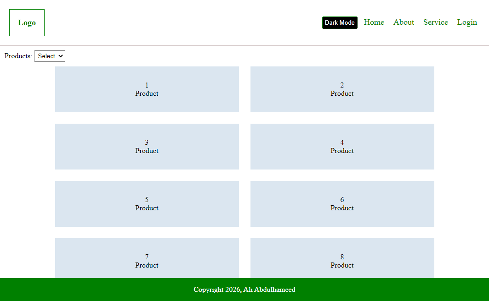
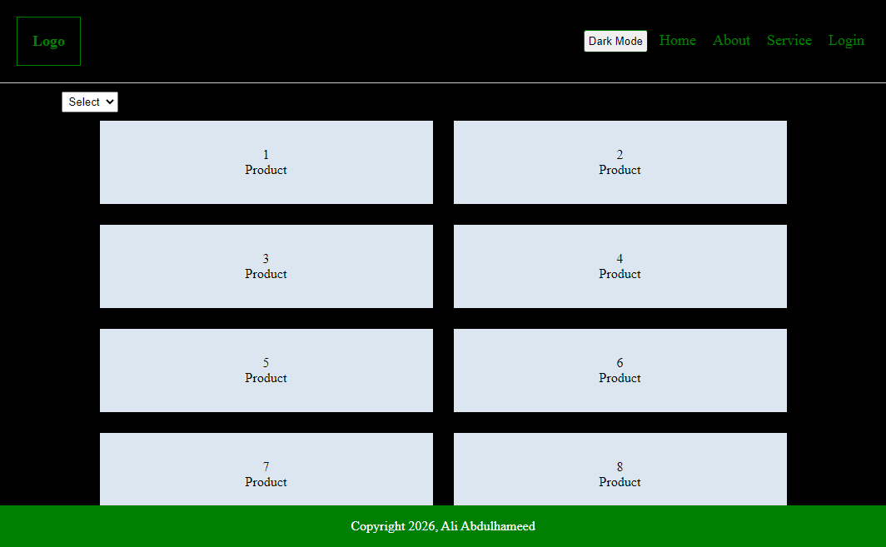
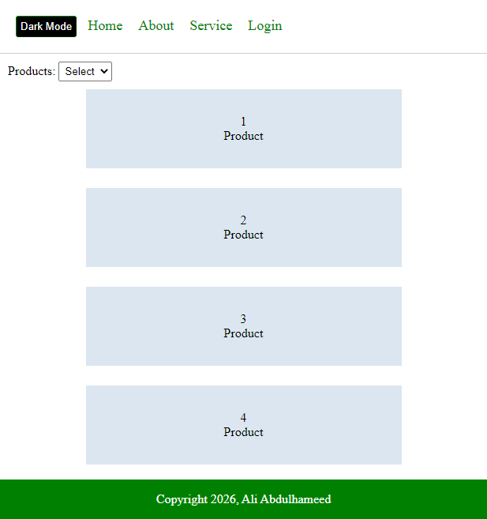

# JavaScript DOM Product Page

A simple product page built entirely with **Vanilla JavaScript** using **DOM Manipulation**.

The project demonstrates how to dynamically create HTML elements, organize JavaScript into separate modules, manipulate the DOM, and add interactive features without using any frontend framework or external library.

> This project was created for learning and practicing modern JavaScript fundamentals.

---

## Features

* Dynamic Header generation
* Dynamic Product Grid generation
* Dynamic Footer generation
* Product cards created using JavaScript loops
* Product Hover Animation
* Dark Mode Toggle
* Dynamic Product Count Selection
* Responsive layout using Flexbox

---

## JavaScript Concepts Practiced

* DOM Manipulation
* `querySelector()`
* `createElement()`
* `createTextNode()`
* `appendChild()`
* `insertBefore()`
* `addEventListener()`
* Functions
* Loops
* Event Handling
* CSS Class Manipulation
* Dynamic Content Rendering

---

## Project Structure

```text
📂 Project
│
├── index.html
├── style.css
│
└── js
    ├── header.js
    ├── main.js
    └── footer.js
```

---

## Page Structure

```text
Header
│
├── Logo
├── Product Counter
└── Dark Mode Button

Main
│
└── Product Grid
    ├── Product 1
    ├── Product 2
    ├── ...
    └── Product N

Footer
│
└── Copyright
```

---

## Technologies

* HTML5
* CSS3
* Vanilla JavaScript (ES6)

---

## Screenshot

### Homepage



### Homepage (Dark Mode)



### Homepage (Mobile Screen)




### Homepage (Select the number of products 2)


### Homepage (Select the number of products 6)


---

## Learning Goals

This project was developed to practice:

* Building page components dynamically
* Working with the Document Object Model (DOM)
* Creating reusable JavaScript functions
* Organizing JavaScript into multiple files
* Handling user interactions with events
* Rendering dynamic content without frameworks

---

## Future Improvements

* Search Products
* Product Filtering
* Sorting Products
* Fetch Product Data from JSON
* Local Storage Support
* Responsive Navigation

---

## Author

**Ali Abdulhameed**

2026
